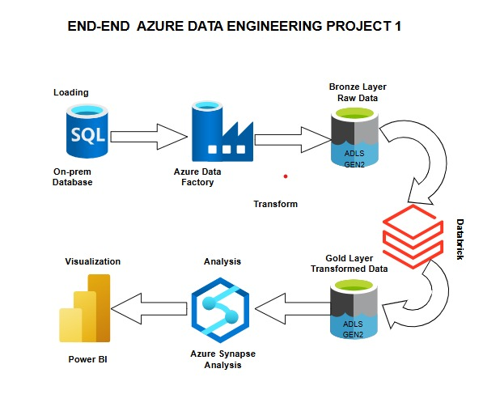

# Azure Data Engineering Project 1 - End-to-End Pipeline

This project demonstrates an end-to-end data engineering pipeline using Azure tools:
- SQL (on-prem sqlserverS)
- Azure Data Factory (ADF)
- Azure Data Lake Storage (ADLS Gen2)
- Azure Databricks (Transform)
- Azure Synapse Analytics (Query)
- Power BI (Visualization)

## 💡 Project Architecture

## 🔧 Steps

### 1. Data Loading (Simulating On-Prem SQL)
- Dataset: `on_prem_data.csv`
- Tool: Azure Data Factory
- Goal: Ingest raw data into ADLS Gen2 (Bronze)

### 2. Azure Data Factory (ADF)
- Pipeline : `/2_adf_pipeline/pipeline_definition.json`
- Linked Service: SelfHosted Integrated Runtime. 
- Dataset: on_prem_data.json`
- Moves data from SQL to ADLS bronze layer.

### 3. ADLS Gen2
- Storage layers:
  - `Bronze`: Raw Ingested Data
  - `Gold`: Cleaned & Transformed Data

### 4. Azure Databricks
- Tool: PySpark
- Script: `/4_databricks_transform/notebook_transform.py`
- Transform logic: Clean, normalize, and write to Gold layer

### 5. Azure Synapse
- SQL Scripts: `/5_synapse_sql/analysis_queries.sql`
- Used to analyze data in Gold layer

### 6. Power BI
- Report: `/6_powerbi/dashboard.pbix`
- Visualizes KPIs and charts

## 📁 Folder Descriptions

| Folder              | Description                                    |
|---------------------|------------------------------------------------|
| `1_data_source/`     | Sample CSV simulating on-prem data             |
| `2_adf_pipeline/`    | ADF pipeline export (JSON)                     |
| `3_adls_layers/`     | Samples of raw and transformed data            |
| `4_databricks_transform/` | PySpark ETL scripts                        |
| `5_synapse_sql/`     | Analysis SQL for Synapse                       |
| `6_powerbi/`         | Power BI .pbix and screenshots                 |

## ⚙️ Tech Stack

- **Azure Data Factory**
- **Azure Data Lake Storage Gen2**
- **Azure Databricks**
- **Azure Synapse Analytics**
- **Power BI**
- **SQL & PySpark**
=======
# Azure_project1
This project is an end to end data engineering project.
>>>>>>> f56cd601e1aec1ca5b33d0f34a7c5343cff198e7
